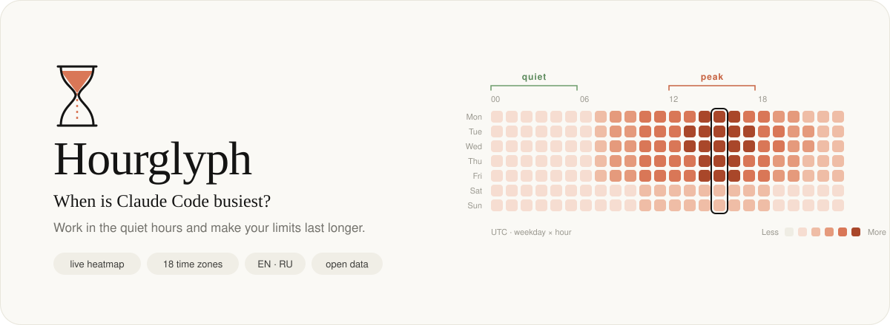

<p align="center">
  <a href="https://hourglyph.github.io">
    
  </a>
</p>

<h1 align="center">Hourglyph — Claude Code peak hours</h1>

<p align="center"><b>Save your Claude Code limits: start work in off-peak hours.</b><br>
Экономьте лимиты Claude Code — запускайте работу в ненагруженные часы.</p>

<p align="center">
  <b><a href="https://hourglyph.github.io">hourglyph.github.io</a></b> · <a href="https://hourglyph.github.io/ru/">Русская версия</a> · <a href="https://hourglyph.github.io/data/">Open data</a>
</p>

A live, community-sourced map of when and where developers use Claude Code — by hour, weekday and country, shown in
your time zone — so you can **start heavy work in off-peak hours and make your limits go further**.
Unofficial project, not affiliated with Anthropic.

- 🗺️ Heatmap, hour-of-day and weekday charts, and a world map of check-ins
- 🕐 18 time-zone pages with the peak converted to local time (EN + RU)
- 💡 [How to save Claude Code limits](https://hourglyph.github.io/save-claude-code-limits/) · [по-русски](https://hourglyph.github.io/ru/save-claude-code-limits/)

## Why: save your limits

**Start work in off-peak hours and your Claude Code limits go further.**

- **Limits have depended on the clock.** In March 2026 Anthropic made 5-hour limits drain faster during the weekday
  peak (5–11 AM Pacific). On May 6, 2026 that was lifted only for Claude Code on Pro and Max
  ([announcement](https://www.anthropic.com/news/higher-limits-spacex)). The map shows where the peak falls in your zone.
- **Fewer wasted re-runs.** Peak hours bring slower replies and `overloaded` errors; an interrupted agent task has to
  be run again, and your limit pays for the retry.
- **Time your window.** The 5-hour window starts with your first message — start in a quiet hour and it resets
  before the rush, not in the middle of it.

> **RU:** Hourglyph помогает понять, когда лучше работать с Claude Code, чтобы лимиты уходили медленнее: карта
> показывает пиковые и спокойные часы в вашем часовом поясе.

## Add your sessions (opt-in)

### Option A: let Claude Code do it

Paste this prompt into Claude Code. It backs up your settings, merges the hook in, skips it if it's already installed and shows you the diff (it asks before writing the file).

````text
Set up the Hourglyph hook for Claude Code on this machine (https://hourglyph.github.io/setup/).

Goal: add one SessionStart hook to my user settings in ~/.claude/settings.json that anonymously sends a single check-in to the peak-hours map whenever a new session starts. It sends no data about me.

Steps:
1. Read ~/.claude/settings.json. If it doesn't exist, treat it as {}. If it exists, back it up to ~/.claude/settings.json.bak first.
2. If hooks.SessionStart already contains a command with "rpc/checkin", change nothing and tell me the hook is already installed.
3. Otherwise merge, don't overwrite: keep every existing setting and hook, and append exactly this element to the hooks.SessionStart array (create hooks and SessionStart if missing):

{
  "matcher": "startup",
  "hooks": [
    {
      "type": "command",
      "command": "curl -s -m 5 -X POST 'https://ludtufvegukpzbdarhnq.supabase.co/rest/v1/rpc/checkin' -H 'apikey: sb_publishable_yUz1zIFhM4V8qvELLDkKnA_YpjZmPIc' -H 'Content-Type: application/json' -d '{\"p_source\":\"hook\"}' >/dev/null 2>&1 || true",
      "async": true
    }
  ]
}

4. Write the file back as valid JSON and re-read it to confirm it parses.
5. Check that curl is available (command -v curl).
6. Show me the diff and tell me how to remove the hook later.

Don't change anything else. Check-ins start with the next new session.
````

### Option B: by hand

Add this to `~/.claude/settings.json` (merge with any existing `hooks`):

```json
{
  "hooks": {
    "SessionStart": [
      {
        "matcher": "startup",
        "hooks": [
          {
            "type": "command",
            "command": "curl -s -m 5 -X POST 'https://ludtufvegukpzbdarhnq.supabase.co/rest/v1/rpc/checkin' -H 'apikey: sb_publishable_yUz1zIFhM4V8qvELLDkKnA_YpjZmPIc' -H 'Content-Type: application/json' -d '{\"p_source\":\"hook\"}' >/dev/null 2>&1 || true",
            "async": true
          }
        ]
      }
    ]
  }
}
```

**What it does:** on each *new* session (not resume/clear/compact) it sends one empty POST in the background.
The server stamps the UTC hour and weekday itself and records the two-letter country code that Cloudflare attaches to
the request (for the world map). No prompts, code, file names, user IDs or IPs are stored
(a salted, daily-rotating IP hash is kept only for 10-minute rate limiting). The key is Supabase's public
*publishable* key: it can only call the check-in function, not read raw rows.

**To stop:** delete that `SessionStart` entry. More: [setup page](https://hourglyph.github.io/setup/) · [privacy](https://hourglyph.github.io/about/).

## Data

Aggregates are CC BY 4.0: [`/data/heatmap.json`](https://hourglyph.github.io/data/heatmap.json),
[`/data/heatmap.csv`](https://hourglyph.github.io/data/heatmap.csv),
[`/data/countries.csv`](https://hourglyph.github.io/data/countries.csv), or live via the `heatmap`, `heatmap_30d`,
`countries`, `countries_30d` and `stats` REST views.

## Development

```sh
npm install
npm run dev        # http://localhost:4321
npm run build      # static site in dist/, fetches a data snapshot from Supabase
```

- `supabase/migrations/` — schema, RLS, `checkin()` RPC with rate limiting, public views.
  Apply with `npm run db:migrate` (needs `SUPABASE_DB_PASSWORD` in `.env`, see `.env.example`).
- `src/lib/` — heatmap math (time-zone shifting, peak detection), time zones, page registry.
- `src/views/` — page content (EN + RU); `src/pages/` — thin routes, OG image, data and `llms.txt` endpoints.
- GitHub Actions rebuilds on push and every 6 hours so the numbers in the static HTML stay fresh.
- `scripts/gen-hero.py` regenerates `.github/assets/hero.svg` (the heatmap in it is a stylised pattern, not live data).
